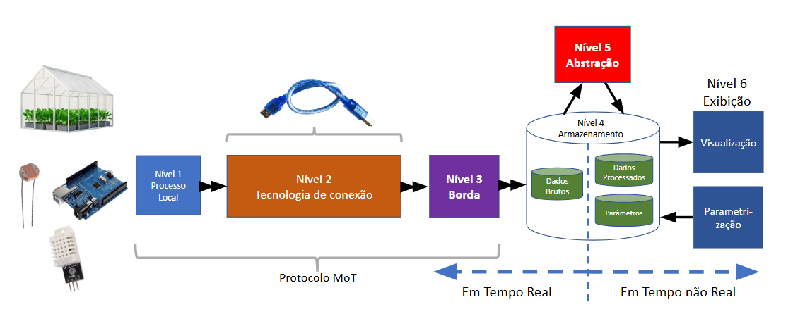
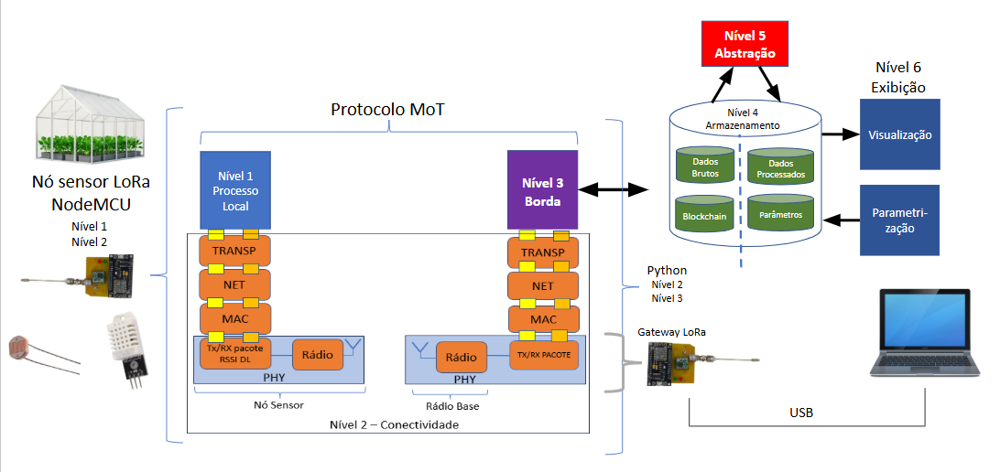

# lora-site-survey-DHT22 

Este repositório apresenta uma descrição detalhada do desenvolvimento de um sistema embarcado com comunicação LoRa e aferição de luminosidade, temperatura e umidade. Todo o projeto foi desenvolvido com base no protocolo MoT e na metodologia TpM.

O objetivo desta documentação é detalhar o funcionamento técnico do sistema de forma didática. Buscamos garantir que engenheiros, desenvolvedores e profissionais interessados no projeto possam compreender com clareza a arquitetura e o fluxo de dados propostos, desde os fundamentos operacionais locais até as transmissões sem fio de longa distância.

---

## 1. O Exemplo Inicial: Coleta de Dados via USB Serial

Para compreender o funcionamento da arquitetura embarcada final, é recomendado iniciar a análise pela sua versão mais simplificada: a integração de um microcontrolador a um sensor referencial comunicando-se através de via física.



Nesta configuração de referência, um sensor de luminosidade (LDR) é conectado a uma porta analógica de um microcontrolador (ex. Arduino). O microcontrolador, por sua vez, estabelece comunicação direta com o sistema computacional através de um barramento USB convencional.

### A Estrutura de Informação em Bytes

A comunicação ocorre primariamente através de informações numéricas brutas, estruturadas em formato binário e agrupadas em **Bytes**, que representam a unidade fundamental de transmissão e comportam um número inteiro limitado à faixa de **0 a 255** (1 byte). Portanto, para que seja possível transmitir um dado maior do que 255, precisamos de **2 bytes**, como é o caso da leitura e conversão do sinal analógico de um sensor LDR pelo ADC (Conversor Analógico-Digital) do microcontrolador, que resulta em amostragens com valores de `0` (ausência de incidência luminosa) a `1023` (luminosidade máxima). 

Uma vez que esses valores excedem a capacidade de armazenamento de um único byte, o firmware fragmenta o dado em **dois bytes distintos**:

- **Byte Inteiro (High Byte):** Formado pelo resultado da divisão inteira do valor da amostragem por `256`. Exemplificando com a leitura ilustrativa de `480`, obtém-se `480 / 256 = 1`.
- **Byte Resto (Low Byte):** Corresponde ao módulo (resto) produzido por essa mesma divisão. Sendo assim, `480 % 256 = 224`.

O microcontrolador submeterá à via serial unicamente o segmento dos vetores independentes representados por `1` e `224`.

> **Exemplo Prático extraído da Camada APP:**
> ```cpp
> // Captura o valor bruto do LDR (0 a 1023)
> luminosidade = analogRead(A0);
> 
> // Fragmenta a luminosidade em 2 bytes restritos alocando-os no pacote
> PacoteUL[17] = (luminosidade / 256); // Byte Inteiro
> PacoteUL[18] = (luminosidade % 256); // Byte Resto
> ```

### A Dinâmica do Protocolo de Recebimento Serial
A interface emulada pela porta USB determina uma comunicação "Serial" síncrona aos dados enviados unidirecionalmente, criando um trânsito sequencial padronizado. O hardware emissor despacha o *Byte Inteiro* imediatamente antes de enviar o *Byte Resto* no ciclo. 

Ao confirmar a captação integral, o processador efetua a operação algébrica modular inversa, multiplicando o recebido Byte Inteiro por `256` em simultaneidade à soma direta com o Byte Baixo correlato: `((1 * 256) + 224)`. Com este procedimento padrão rápido, o dado linear prévio absoluto de `480` é reconstruído no script preservando seu valor de envio.

> **Exemplo Prático do Processo Reverso (Script em Python):**
> ```python
> # O computador lê o pacote originário inteiriço na serial
> Pacote_UL = ser.read(TAMANHO_PACOTE)
> 
> # Regra matemática re-acoplando o valor de luminosidade original
> luminosidade = 1023 - (Pacote_UL[17] * 256 + Pacote_UL[18])
> ```

---

## 2. Estruturação do Pacote de 9 Bytes

O repositório prevê aferições de **Temperatura** e **Umidade Relativa** por meio do sensor **DHT22**.

Substituindo o envio simplificado unidirecional anterior para agregar os três vetores de dados, os receptores dependem de pré-requisitos lógicos codificados que consigam diferenciar o fluxo das rotinas. Utiliza-se então a modelagem formatada sob um arranjo fechado denominado de **Pacote de Dados (Payload)**.

### A Estrutura Funcional do Pacote (Payload)
Pacotes de dados funcionam como um formulário padronizado, onde cada informação tem seu lugar fixo e sequencial. Essa organização garante que os dados sejam lidos corretamente do outro lado, evitando que o computador se perca e confunda a leitura da luz com os valores de temperatura.

### O Pacote de 9 Bytes
Neste projeto, o modelo divide a estrutura em blocos de **3 bytes para cada grandeza medida**. O resultado é uma sequência de exatos `9 bytes` enviados por ciclo de leitura (`3 de Luminosidade, 3 de Temperatura, 3 de Umidade`).

1. **Luminosidade (3 bytes):**
   - **1 Byte Identificador (Flag):** Funciona como um aviso da grandeza que está sendo lida. Por exemplo, adotamos o número `44` para indicar que os dados a seguir vieram de um LDR.
   - **2 Bytes de Dados:** Correspondem ao *Byte Inteiro* e *Byte Resto*, com o valor da luminosidade calculado anteriormente.

2. **Temperatura (3 bytes):**
   Como valores de temperatura possuem casas decimais (ex: `25.30 °C`) e não podemos enviar números "quebrados" tão facilmente pela porta serial, multiplicamos o número original por `100`. Assim, `25.30` se torna perfeitamente o número inteiro `2530`.
   - **1 Byte Identificador (Flag):** Adotamos `22` na flag para englobar dados vindos do sensor DHT22.
   - **2 Bytes de Dados:** O valor `2530` é quebrado nas parcelas de *Byte Inteiro* e *Byte Resto*. Ao receber essas metades no PC, o software junta as duas partes e divide por `100` para colocar a vírgula novamente no lugar certo.

3. **Umidade Relativa (3 bytes):**
   Usa a mesma lógica simplificada da temperatura. Convertemos o valor `68.50 %` para o número inteiro `6850`.  
   - **1 Byte Identificador (Flag):** Também utilizamos a `22` para identificar o sensor DHT22.
   - **2 Bytes de Dados.**

> **Exemplo Prático no Código Transmissor:**
> ```cpp
> // Lê a temperatura e umidade a partir do DHT22
> dht22.read2(&temperatura, &umidade, NULL);
> 
> // Multiplica o valor em float por 100 para transformar em inteiro (ex: 25.39 -> 2539)
> int temp_x100 = (int)(temperatura * 100);
> 
> // Preenche o pacote com a Flag (22) e os bytes Inteiro e Resto em suas caixas
> PacoteUL[19] = 22;                
> PacoteUL[20] = (temp_x100 / 256); // Temperatura - byte inteiro (alto)
> PacoteUL[21] = (temp_x100 % 256); // Temperatura - byte resto (baixo)
> ```
> Durante a recepção via Python, o script reverte a escala resgatando a casa decimal original:
> ```python
> temperatura = (Pacote_UL[20] * 256 + Pacote_UL[21]) / 100.0
> ```

---

## 3. Demanda Reais e Limites do Cabo USB

Esse sistema de envio contínuo para leitura instantânea de múltiplos focos é bastante demandado em cenários reais, como é o caso das **Fazendas Verticais**. Nelas, hortaliças e plantas crescem superpovoadas em inúmeras prateleiras estufadas sob longas fileiras de luz de LED operando metodicamente. Sem sol natural ou controle do ambiente externo aberto, qualquer falha isolada no ciclo compromete todo o cultivo.

### A Importância do Monitoramento Ininterrupto
Controlar de forma pontual essas três variáveis em cada estrutura é o que impede que o todo o agronegócio seja perdido:
- **Luminosidade:** Intensidades erradas bloqueiam a fotossíntese natural e enfraquecem as plantas recém geradas; enquanto isso, o excesso produz um altíssimo consumo e desperdício com custos de energia elétrica.
- **Temperatura e Umidade:** As grandes aglomerações das plantas e a evaporação retida tornam o abafamento da prateleira um ambiente rico e propenso para o florescimento desenfreado de fungos e doenças botânicas.

Utilizando as informações do monitoramento, os computadores conseguem ligar perfeitamente ar-condicionados centrais ou alterar recursos no galpão, evitando que as plantas sejam destruídas ou cozinhem enquanto o local é checado de forma eficiente via painel de visualização.

### Limitações Físicas (Cabo USB) 
Embora acoplar as plaquinhas direto ao seu computador através das ligações com cabo Serial/USB funcione perfeitamente nos laboratórios operacionais para avaliações do código essa rota é inviável na escala de um galpão agrônomo gigantesco ao aplicar no terreno local pela barreira limitadora física:
- **Distância Curta de Funcionamento:** A transferência elétrica pura de cabos USB atenua rapidamente pela resistência. Se a prateleira com os sensores instalados passar da área radial de meros **5 metros** do pino PC, a transferência de dados e energia corrompe as transmissões, ocorrendo incontáveis travamentos na operação de serial.
- **O Emaranhamento Problemático dos Fios:** Imagine conectar cerca de trezentos sensores rurais emparedados em tetos puxando frotas imensas com milhares de fios embaraçados e cruzados atolando todos os espaços do galpão, onde também ocorrem podas rotineiras e respingos em abundância.

Precisamos cortar as extensões cabeadas rotineiras e cruzar os limites do galpão com maior velocidade, transitando todo ambiente de transmissão final para redes autônomas sem o auxílio centralizador direto do fio.

---

## 4. Transições ao NodeMCU em Rádio LoRa

Para substituir as conexões cabeadas, podemos utilizar a tecnologia **LoRa (Long Range)**, modulada. Seu transmissor tem consumo pífio se comparado com outras teconologias (como o Wi-Fi) e o alcance é muito maior, podendo chegar a 500m em ambientes fechados, tendo como único ponto negativo a taxa de transmissão, mas para os fins deste projeto, o **RFM95** será suficiente.

Além disso, utilizaremos o **NodeMCU** para o projeto. 

### Dividindo o Sistema (O Nó e o Portal Gateway)
A arquitetura é dividida em dois equipamentos principais, que operam em conjunto de forma sem fio, garantindo a comunicação ao longo de todo o galpão:



1. **Nó Sensor Local:** Trata-se do equipamento fixado nas prateleiras de plantio, alimentado por baterias. Ele é focado exclusivamente em ler os sensores ambientais e não possui conexão com fios de energia ou computadores. O Nó coleta os dados do clima continuamente e os emite pelo ar via rádio LoRa, despachando as informações para a central.
2. **Portal Gateway (Receptor Central):** É uma placa semelhante, porém instalada em um local seguro e estático, conectada ao computador via cabo USB, dentro do escritório da fazenda. Ele não possui sensores voltados para o ambiente. Sua única função é operar como um "ouvinte", captando continuamente os pacotes de rádio que estão no ar e empurrando essas métricas diretamente pelo cabo USB para o computador. A partir daí, o software em Python exibe e processa os dados de forma visual e gráfica para a equipe.

### O Pacote de Comunicação (52 Bytes)
Enviar um pacote de apenas `9 Bytes` (contendo unicamente os dados puros dos sensores) não funciona para essa aplicação. Em um galpão com muitos sensores enviando dados ao mesmo tempo, essas ondas eletromagnéticas podem se cruzar e sofrer colisões, impossibilitando que a base saiba de qual sensor veio a leitura.

Para garantir que os pacotes cheguem organizados e blindados contra perdas, a transmissão foi formatada em pacotes com tamanho rígido de **52 Bytes**:
- **Cabeçalhos de Rota e Identidade (Bytes 00 a 15):** Contêm metadados cruciais para a transmissão, como o **RSSI** (força do sinal recebido na antena) e o **SNR** (relação entre os ruídos do ar e a qualidade do sinal). Além disso, enviam como se fosse a "placa de um carro", o **ID de Origem e Destino**. Isso garante que o receptor no computador rejeite sinais de galpões vizinhos e saiba com precisão qual estufa mandou a umidade e temperatura lida.
- **O Núcleo de Dados (Bytes 16 a 24):** Acomoda de forma intocada e perfeitamente segura os nossos exatos `9 Bytes` contendo as leituras métricas brutas das lógicas que vimos acima.
- **Reservas e Sobras de Manutenção (Bytes 25 a 51):** Espaços sem informação, preenchidos estaticamente com zeros. O benefício prático desse é criar uma simetria de pacote contínua sem precisar refazer tudo. Dessa forma, caso a indústria adicione novos medidores ambientais de solo daqui a alguns meses, os dados extras entrarão diretamente nessas cadeiras vazias do envio sem causar a necessidade de refatorar a máquina receptora do Gateway.

### Arquitetura em Camadas (Separando Código e Ação) 
O firmware foi separado de acordo com a 

As funções e rotinas internas se dividem para facilitar manutenções ou reparos, nunca corrompendo uma a outra:

- **Camada APP (Aplicação):** Trabalha focada unicamente se comunicando e extraindo os dados elétricos dos sensores (luminosidade, temperatura) sem se envolver ou solicitar peças e envios do rádio.
- **Camada TRANSP (Transporte):** Reagrupa e transporta essas métricas e leituras da camada anterior preenchendo e formatando perfeitamente o arranjo modular do pacote de dados final.
- **Camada NET (Rede):** Assina ativamente e embute no endereço de envio o cabeçalho base de Origem e Destino, criando regras garantidoras de rota oficial limitando quem emite e quem de fato recebe.
- **Camada MAC (Controle de Acessos):** Age contendo e controlando o fluxo e ritmo de liberação contínua dessas ordens eletrônicas; inibindo engarrafamentos estáticos nas chamadas rítmicas para não travar os envios nem superaquecer o processamento físico da placa.
- **Camada PHY (A Física do Rádio):** A sub-seção estrita que centraliza isoladamente a integração com a Placa modular do rádio transmissor (RFM95) disparando suas ordens de comando e transferindo fisicamente nosso array para o ar via onda eletromagnética codificada. Ela trabalha pura, lidando diretamente com impulsos da antena e não executa ordens para as lógicas superiores focadas na temperatura original da Camada App ou Redes. 

> **Exemplo Simples de Roteamento Isolado na Camada Física (PHY):**
> ```cpp
> // O único bloco da rotina lidando e trabalhando intímo com o injetor de sinal LoRa da Antena:
> LoRa.beginPacket();                 // Energiza emissor preparando para o início rádio  
> for (int i = 0; i < TAMANHO_PACOTE; i++) {
>   LoRa.write(PacoteUL[i]);          // Transfere eletricamente para a antena nosso vetor inteiro dos 52 bytes engessados.
> }
> LoRa.endPacket();                   // Propaga pra faixa de ar o pacote LoRa e encerra o fluxo elétrico nativo via passivo!
> ```

